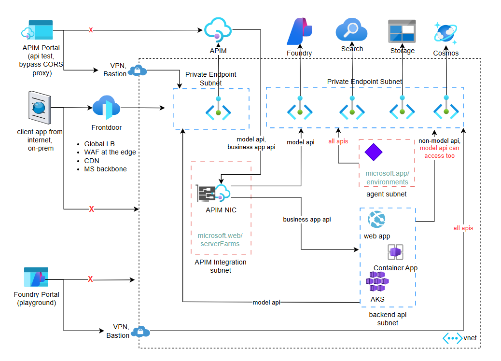

# Test scenarios for network isolated Azure API Management and AI Foundry

## Requirements

- AI Foundry and its dependent services are behind private endpoints
- AI Foundry model endpoints are exposed as API Management APIs
- API Management is behind a private endpoint

> There's nothing restricting the incoming traffic to the Foundry private endpoints,
even though ideally all calls to the model endpoint should go through APIM. 
Private endpoints subnet NSG is disabled. To limit inbound traffic to private
endpoints, use Azure Firewall or limit private DNS resolution of the endpoints to
only certain vnets.

> This architecture deploys APIM Standard V2 with private endpoints and
vnet integration. This is suitable if you don't require features such as 
multi-region deployment, self-hosted gateway, or private developer portal access.
See [detailed feature comparisons of APIM tiers](https://learn.microsoft.com/en-us/azure/api-management/api-management-features). 

## Test scenarios

### Pre-requisites

Expose AI Foundry model endpoints to APIM. You can do so in the Azure APIM portal `API`,
or programmatically by running `az apim api create ...`.

### From outside the VNET

> Note: The isolated network controls traffic in the data plane, not management plane.
The portal features such as view the Foundry projects or managing APIM APIs should still work.

1. AI Foundry portal "playground" feature should not work.
1. APIM API portal "test" feature should not work.
1. An application calling APIM model APIs should not work.
 Run `python chat.py` to verify.
1. An application calling AI Foundry model APIs should not work.
 Switch the endpoint in `chat.py` to AI Foundry and run `python chat.py` to verify.
1. An application calling AI Foundry agent should not work.
 Run `python agent.py` to verify.

### From inside the VNET

1. AI Foundry portal "playground" feature should work.
1. APIM API portal "test" feature should work.
1. An application calling APIM model APIs should work.
1. An application calling AI Foundry model APIs directly should also work.
1. An application calling AI Foundry agent should work.
